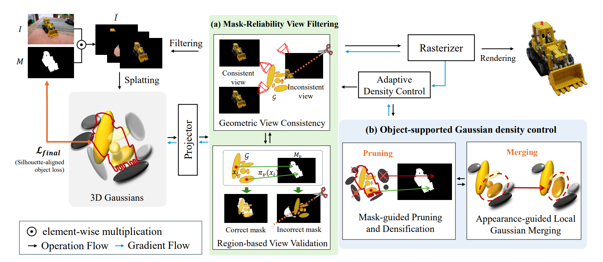
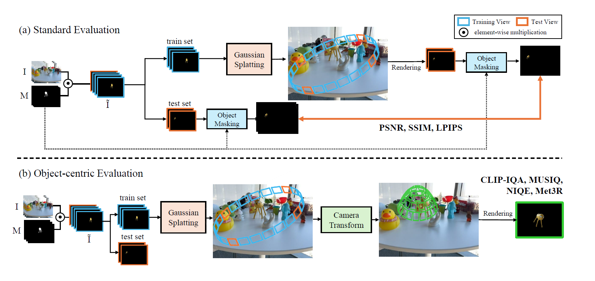

# MaRO-GS: Mask-Robust Object-Centric Gaussian Splatting from Inconsistent Multi-view Masks.


[](#) [](#) [](https://eunjikim02.github.io/marogs/) [](https://hub.docker.com/r/mobuk/marogs)

[Eunji Kim](https://eunjikim02.github.io/)<sup>\*</sup>, [Gahyeon Kim](https://github.com/kgh1234)<sup>\*</sup>, [Gianella Cravioto](https://www.linkedin.com/in/gianella-cravioto/), Dong-hun Lee, [Chaewon Moon](https://mchaewon.github.io/), [Chae-yeong Song](https://www.linkedin.com/in/chae-yeong-song-171816259), and [Sang-hyo Park](https://scholar.google.com/citations?user=ZG8REuYAAAAJ&hl=en)<sup>†</sup>

Kyungpook National University

<sup>\*</sup> Equal contribution &nbsp;&nbsp; <sup>†</sup> Corresponding author

---





## Environmental Setup


### 1. Clone the Repository

```bash
git clone https://github.com/kgh1234/MaRO-GS --recursive
```


### 2. Environment Configuration

For convenience, we provide a pre-built Docker environment!

``` bash
docker pull mobuk/marogs:latest
```

This Docker image does not include the source code.
Please use the mount option to link the cloned GitHub repository.

``` bash
docker run -it -v $(pwd):/workspace --gpus all --shm-size=16g --name marogs mobuk/marogs:latest /bin/bash
```


### 3. Dataset

This paper uses these four datasets. The original source can be downloaded as follows:

- MipNeRF360 : https://jonbarron.info/mipnerf360/
- LERF-Mask : https://github.com/lkeab/gaussian-grouping/blob/main/docs/dataset.md
- DTU datasets : https://roboimagedata.compute.dtu.dk/
- Tanks and Temples : https://www.tanksandtemples.org/

In accordance with the license terms, we are distributing the mask annotations for **lerf-mask**. Please download them using the link below.

- LERF-Mask : Coming Soon

If the link does not work, please contact now0104@knu.ac.kr .


*** For other datasets, mask annotations were generated by referring to the contents of [`dataset/Dataset.md`](dataset/Dataset.md). 


After downloading, organize the datasets as follows:

```
MaRO-GS
data
├── lerf_mask
│   ├── figurines_15
│   │   ├── images
│   │   ├── mask
│   │   ├── sparse
│   │   
│   ├── figurines_33
│   ├── ...
│
├── mipnerf
│   ├── bicycle
│   ├── ...
│
├── tanks_temples
│   ├── Barn
│   ├── ...
│
├── dtu
│   ├── scan02
│   ├── ...
│
...

```


## End-to-end running

All scripts are run from the repository root. Set `SCENE_NAME` / `ROOT` / `OUTPUT_ROOT` at the top of each script to match your dataset.

### Sec. 4.2 — Rendered Results of Object-centric 3D Gaussian Splatting

Trains every scene under `data/${SCENE_NAME}` (LERF-Mask, Mip-NeRF 360, Tanks and Temples) from object-masked multi-view images, renders the test views, and reports PSNR / SSIM / LPIPS / FPS computed only over the object-mask regions (Table 1). Training time, peak VRAM and the number of Gaussians are also logged to `output/${SCENE_NAME}/${SCENE_NAME}_metrics.csv`.

``` bash
bash script/train_4_2.sh <SCENE_NAME>   # e.g. lerf_mask, mipnerf, tanks_temples (folder name under data/)
```

### Sec. 4.3 — Evaluation of Object Boundary Quality

Evaluates the boundary quality of reconstructed target objects on LERF-Mask, on images that include background regions, following the protocol of FlashSplat and BEA-GS (Table 2). One model is trained per object in `OBJECT_LIST`, test masks are rendered with `render_lerf_mask.py`, and mIoU / bIoU are computed with `script/eval_lerf_mask.py`. Per-object results are written to `log/eval_${DATASET_NAME}_summary.csv`.

``` bash
bash script/train_4_3.sh
```

### Sec. 4.4 — Additional Evaluation for Object-centric Reconstruction

**Robustness Evaluation under Mask Errors.** DTU samples are divided into Easy / Medium / Hard groups by mask error ratio (< 10%, 10–50%, > 50%) and evaluated with PSNR / SSIM / LPIPS (Table 3). Run `bash script/train_4_2.sh dtu`.

**Object-centric Viewpoint Evaluation.**



Novel views are rendered on a hemisphere around the target object. Since these viewpoints have no ground-truth images, perceptual quality is assessed with no-reference metrics: CLIP-IQA+ (↑), MUSIQ (↑) and MEt3R (↓) (Table 4). Results are appended to `${OUTPUT_ROOT}/all_scores_summary_met3r.csv`.

Install the additional packages for the object-centric evaluation:

``` bash
pip install open3d                                      # camera trajectory generation (nerf_dir_camera.py)
pip install pyiqa==0.1.12 "numpy<2"                     # CLIP-IQA+, MUSIQ (newer pyiqa upgrades numpy to 2.x)
pip install git+https://github.com/openai/CLIP.git      # CLIP backend for CLIP-IQA+
pip install git+https://github.com/mohammadasim98/met3r # MEt3R
pip install timm==0.9.16                                # pyiqa needs timm>=0.9 (met3r pins 0.4.12; MEt3R scores are identical)
```

``` bash
bash script/eval_4_4.sh
```

To compute only SSIM / PSNR / LPIPS / mIoU for already trained models:

``` bash
bash script/object_eval.sh
```


## Hyperparameters

Our method follows the default 3DGS configuration, except that the densification gradient threshold (`--densify_grad_threshold`) is increased from `0.0002` to `0.0003`.

### MaRO-GS Module Control

| Argument | Default | Description |
|---|---|---|
| `--geometric_filtering` | `True` | Enable/disable **geometric view consistency** (mask-reliability view filtering, Sec. 3.2) |
| `--region_filtering` | `True` | Enable/disable **region-based view validation** (mask-reliability view filtering, Sec. 3.2) |
| `--prune_ratio` | `1.0` | Ratio of **mask-guided pruning and densification** (Sec. 3.3). Set to `0.0` to disable pruning |
| `--gaussian_merge` | `True` | Enable/disable **appearance-guided local Gaussian merging** (Sec. 3.3) |
| `--object_weight_loss` | `True` | Enable/disable the object-weighted photometric loss $\mathcal{L}_{obj}$ (Sec. 3.4) |
| `--mask_iou_loss` | `True` | Enable/disable the silhouette loss $\mathcal{L}_{sil}$ (Sec. 3.4) |

### Mask-Reliability View Filtering

| Argument | Default | Description |
|---|---|---|
| `--filtering_start` | `1000` | Iteration at which geometric view consistency starts |
| `--filtering_interval` | `2000` | Interval (in iterations) at which geometric view consistency is performed |
| `--filtering_end` | `5000` | Iteration at which geometric view consistency stops (inclusive, capped at `densify_until_iter - 1`) |
| `--hit_ratio` | `0.05` | Hit ratio threshold $\tau_{hit}$ for region-based view validation. Views with $H_i < \tau_{hit}$ are excluded from subsequent training |

The threshold $\tau_{geo}$ for geometric view consistency is determined adaptively from the largest gap of the sorted object covisibility scores, so it has no command-line argument. Region-based view validation is performed once at iteration 1800.

### Mask-Guided Pruning and Densification

| Argument | Default | Description |
|---|---|---|
| `--prune_iterations` | `1000 3000 5000` | Iterations at which mask-guided pruning is performed |
| `--threshold_prune_k` | `0.5` | Coefficient $k$ of the adaptive pruning threshold ($\tau_{mask}$ based on $\mu + k\sigma$ of the mask-overlap ratios). Higher values prune more aggressively |
| `--pruning_max` | `0.05` | Conservative upper bound of $\tau_{mask}$ to prevent over-pruning |

### Appearance-guided Local Gaussian Merging

| Argument | Default | Description |
|---|---|---|
| `--start` | `0` | Iteration at which Gaussian merging starts |
| `--step` | `2000` | Interval (in iterations) at which Gaussian merging is performed |
| `--end` | `5000` | Iteration at which Gaussian merging stops (exclusive) |

Merging is only performed at densification steps, so `--start` and `--step` should be multiples of `100`.

### Silhouette-aligned Object Loss

| Argument | Default | Description |
|---|---|---|
| `--mask_iou_weight` | `1.0` | Weight $\lambda_{sil}$ of the silhouette loss $\mathcal{L}_{sil}$ |
| `--mask_iou_start_iter` | `5000` | Iteration at which $\mathcal{L}_{sil}$ starts |
| `--mask_iou_interval` | `100` | Interval (in iterations) at which $\mathcal{L}_{sil}$ is applied |

$\mathcal{L}_{obj}$ is applied after the first `--prune_iterations` step, with the background attenuation factor $\gamma = 0.01$.

### Mask

| Argument | Default | Description |
|---|---|---|
| `--mask_dir` | `""` | Path to the object mask directory |
| `--mask_binary_threshold` | `128` | Binarization threshold for masks (0–255) |
| `--mask_invert` | `False` | Invert the mask |
| `--mask_disabled` | `False` | Disable mask entirely |

### Training

| Argument | Default | Description |
|---|---|---|
| `--iterations` | `30000` | Total number of training iterations |
| `--test_iterations` | `7000 30000` | Iterations at which test evaluation is performed |
| `--save_iterations` | `7000 30000` | Iterations at which the model is saved |
| `--checkpoint_iterations` | `[]` | Iterations at which checkpoints are saved |
| `--start_checkpoint` | `None` | Path to checkpoint to resume training from |
| `--white_background` | `False` | Use white background |
| `--disable_viewer` | `False` | Disable the GUI viewer |


## TODO

- [ ] Code update
- [ ] arXiv upload
- [ ] Dataset update (LERF-Mask)


## Acknowledgement

This work was partly supported by the National Research Foundation of Korea(NRF) grant funded by the Korea government(MSIT)(RS-2025-00520308, 50%) and the Glocal 30 program of Kyungpook National University, funded by the Ministry of Education(25%) and by Culture, Sports and Tourism R&D Program through the Korea Creative Content Agency grant funded by the Ministry of Culture, Sports and Tourism in 2026(RS-2026-2552393, 25%)
